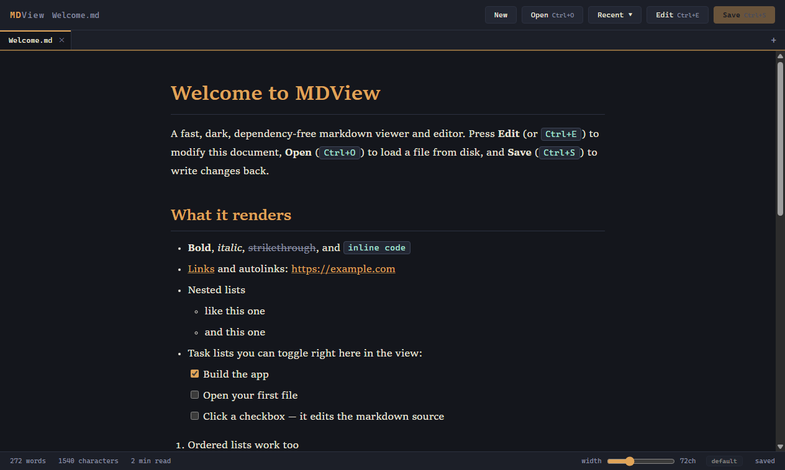
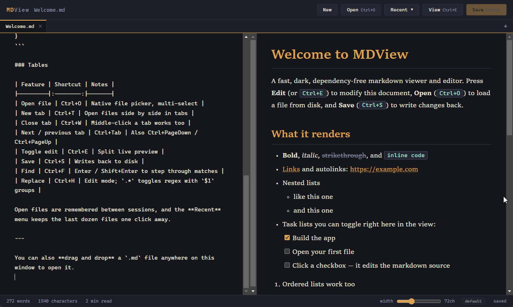

# MDView

A fast, simple Markdown viewer and editor.



<details>
<summary>Edit mode with split live preview</summary>



</details>

## Download

Grab [2.1.0](https://github.com/HristoAtanasovDimitrov/MDView/releases/tag/v2.1.0) (or the latest from [Releases](https://github.com/HristoAtanasovDimitrov/MDView/releases)):

| Platform | File | Notes |
|----------|------|-------|
| Windows | [`MDView_2.1.0_x64-setup.exe`](https://github.com/HristoAtanasovDimitrov/MDView/releases/download/v2.1.0/MDView_2.1.0_x64-setup.exe) | ~1 MB. Per-user install, associates `.md` files. Unsigned: SmartScreen may prompt (More info → Run anyway) |
| macOS | [`MDView_2.1.0_universal.dmg`](https://github.com/HristoAtanasovDimitrov/MDView/releases/download/v2.1.0/MDView_2.1.0_universal.dmg) | One build for Apple Silicon and Intel. Unsigned: right-click the app → Open the first time |
| Linux (any distro) | [`MDView_2.1.0_x86_64.flatpak`](https://github.com/HristoAtanasovDimitrov/MDView/releases/download/v2.1.0/MDView_2.1.0_x86_64.flatpak) | Flatpak bundle: `flatpak install MDView_2.1.0_x86_64.flatpak`. Works on Rocky/RHEL 8+, Arch/Omarchy, Ubuntu, and anything else with Flatpak; the shared GNOME runtime is fetched from Flathub on first install |
| Linux (Ubuntu/Debian) | [`MDView_2.1.0_amd64.deb`](https://github.com/HristoAtanasovDimitrov/MDView/releases/download/v2.1.0/MDView_2.1.0_amd64.deb) | ~2 MB, uses the system WebKitGTK |
| Linux (Rocky 10/Fedora) | [`MDView-2.1.0-1.x86_64.rpm`](https://github.com/HristoAtanasovDimitrov/MDView/releases/download/v2.1.0/MDView-2.1.0-1.x86_64.rpm) | On Rocky, enable EPEL first: `sudo dnf install epel-release`. Not installable on Rocky 8/9 (no WebKitGTK 4.1 there - use the Flatpak) |
| Linux (other) | [`MDView_2.1.0_amd64.AppImage`](https://github.com/HristoAtanasovDimitrov/MDView/releases/download/v2.1.0/MDView_2.1.0_amd64.AppImage) | Bundles its own WebKitGTK (large). `chmod +x` and run. Needs glibc ≥ the build runner's (Ubuntu 24.04) |

Since 2.0 MDView is built with [Tauri](https://tauri.app) instead of Electron, shrinking
the installer from ~80 MB to ~1 MB by rendering in the OS webview (WebView2 on Windows,
preinstalled on Windows 10/11 - the installer fetches it automatically if missing).

There is also a zero-install flavor: open [MDView.html](MDView.html) in Edge/Chrome.

## Features

- Reading view with book-style serif typography
- Tabs: open several files at once (`Ctrl+T` / `Ctrl+W` / `Ctrl+Tab`),
  restored automatically on the next launch
- Recent-files menu with the last dozen opened documents
- Clickable task-list checkboxes in the reading view - toggling one edits the source
- Edit mode (`Ctrl+E`) with split live preview
- Open (`Ctrl+O`, multi-select), Save (`Ctrl+S`), drag & drop
- Find (`Ctrl+F`) with match highlighting and Enter / Shift+Enter / F3 stepping
- Search & replace (`Ctrl+H`) with a regular-expression toggle and `$1` capture groups
- Adjustable reading width with a persistent "set default"
- Links open in the system default browser
- Word count, character count, reading time
- Unsaved-changes indicator (pulsing amber rule under the toolbar)
- Dependency-free markdown renderer: headings, emphasis, code, lists,
  task lists, tables, blockquotes, links, images, horizontal rules

## Development

Prerequisites: Node, [Rust](https://rustup.rs) (stable), and on Windows the
Visual Studio C++ build tools.

```bash
npm install     # once
npm start       # run the app in dev mode
npm run dist    # build the installer for the current platform
```

Installers land in `src-tauri/target/release/bundle/`. They are unsigned, so
SmartScreen may prompt on first run (More info → Run anyway).

## Project layout

- `app/index.html` - the entire UI and markdown renderer, unchanged from 1.x
- `sync.js` - copies `app/index.html` to `src/index.html`, inlining `src/shim.js`
  (runs automatically before every dev run and build)
- `src/shim.js` - the `window.mdview` IPC bridge, implemented on Tauri
  (dialogs, drag & drop, external links, window-title sync)
- `src-tauri/src/main.rs` - the native side: file I/O, CLI/file-association
  opens, single instance
- `src-tauri/tauri.conf.json` - window, bundle, and file-association config
- `build/gen-icon.ps1` - regenerates the icons in `build/`
- `MDView.html` - the original standalone browser version

## License

[MIT](LICENSE)
